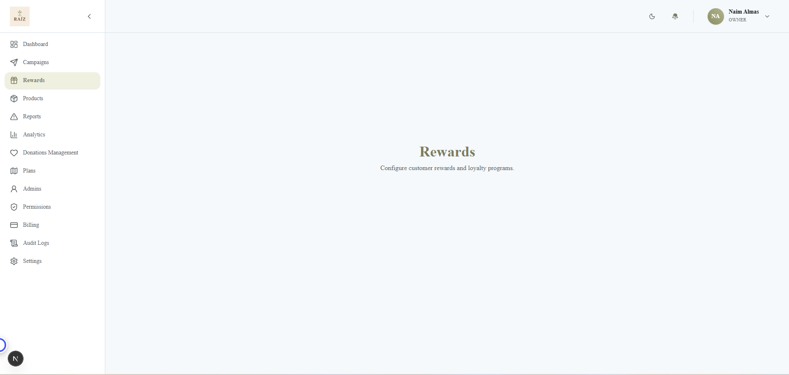

# Raíz Dashboard

A premium, responsive dashboard built with Next.js 15, Redux Toolkit, and Tailwind CSS.



## Tech Stack
- **Framework**: Next.js 15 (App Router)
- **State Management**: Redux Toolkit
- **Styling**: Tailwind CSS 4 + shadcn/ui
- **Icons**: Lucide React

## Getting Started

First, run the development server:

```bash
npm run dev
```

Open [http://localhost:3000](http://localhost:3000) with your browser to see the result.

## Project Structure
- `src/app/(dashboard)`: Contains all dashboard routes (Campaigns, Analytics, etc.)
- `src/components/dashboard`: Shared UI components like Sidebar and Navbar
- `src/lib/redux`: Redux store and slices for state management
